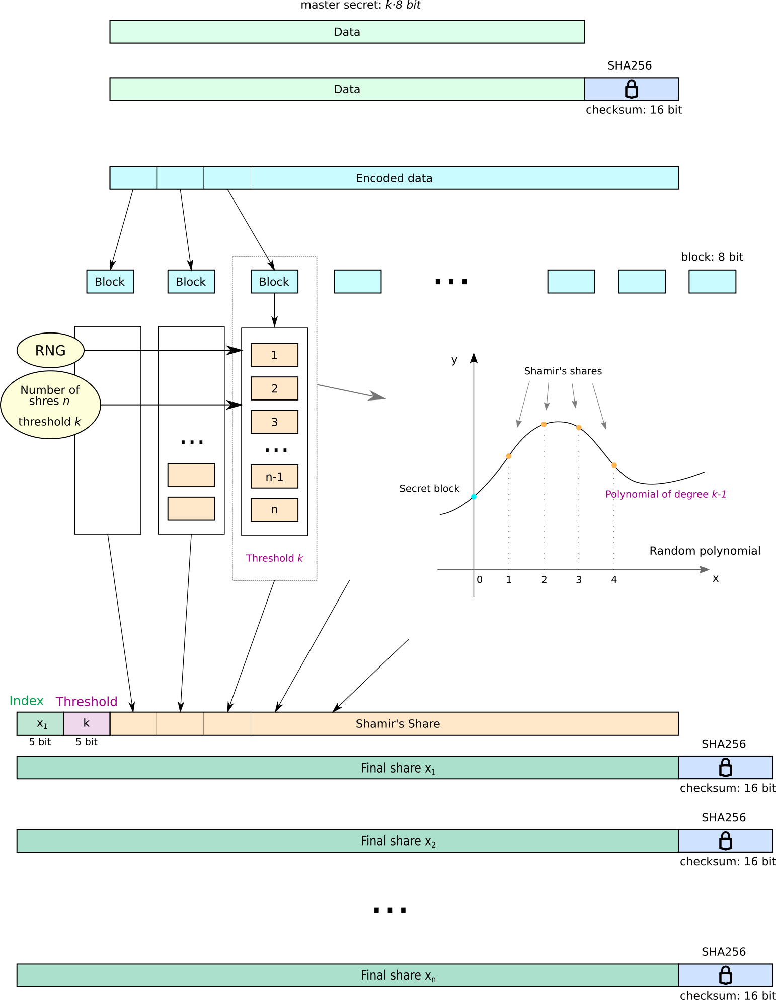

# Shamir's secret sharing scheme for HD-bitcoin wallets

[Shamir's secret sharing](https://en.wikipedia.org/wiki/Shamir%27s_Secret_Sharing) enables to split some secret between multiple parties in a secure way through the use of *shares*. In order to reconstruct original secret from shares, specific number of those shares is required (reconstruction threshold), while if not enough shares is available, no information about the secret is revealed.

There are many ways of implementing this technique. This program implements design proposed by document [SLIP39](https://github.com/satoshilabs/slips/blob/master/slip-0039.md).
It operates on enthropy used for generating Bitcoin [HD-wallet](https://github.com/bitcoin/bips/blob/master/bip-0032.mediawiki) seed which is currently handled mostly as mnemonic phrase string specified in [BIP39](https://github.com/bitcoin/bips/blob/master/bip-0039.mediawiki).

**This is experimental implementation and may contain bugs - use it on your own responsibility.**

Current version of the program reads BIP39 mnemonic phrase, restores encoded enthropy and splits it into given number of Shamir's shares with a given reconstruction threshold. Each share is serialized string containing metadata (share index and reconstruction threshold), the secret share payload, and checksum for random errors detection. The string is encoded using wordlist, as specified in SLIP39.

Program is able to consume hares produced with this restore original secret (enthropy) and outputs it as BIP39 mnemonic phrase (in current version). Reconstruction threshold is extracted from the first share and keeps asking for another shares unless the reconstruction threshold is reached.

The simple schematics of how this was implemented is given in the following picture:<br>
<div align="center">
<a href="docs/long-message-shamir.png">
</a>
</div>

## Compilation
Program follows standard C++11 and can be compiled using command
```
$ make
```
in project directory.
It does not require any additional non-standard libraries, but requires access to device `/dev/urandom`.

## Basic usage
Program either splits enthropy into SLIP39 Shamir's shares or reconstructs enthropy from SLIP39 Shamir's shares. Behaviour can be set by specifying `--distribute` (`-d`) or `--merge` (`-m`). If not specified default option is `-d`.
If `-d` is used, also `--threshold` (`-n`) and `--count` (`-n`) must be supplied together with corresponding values.

Threshold must be number in a range 1 ... 32, total share count must be greater or equal to the threshold but at most 32.
```
$ ./shamir --distribute --threshold 3 --count 5
$ ./shamir -d -t3 -n5
$ ./shamir -t3 -n5
$ ./shamir --merge
```
Program asks for additional information interactively. It is not very safe to type secret phrases directly onto command line, because this could be visible to other users or in command history.
