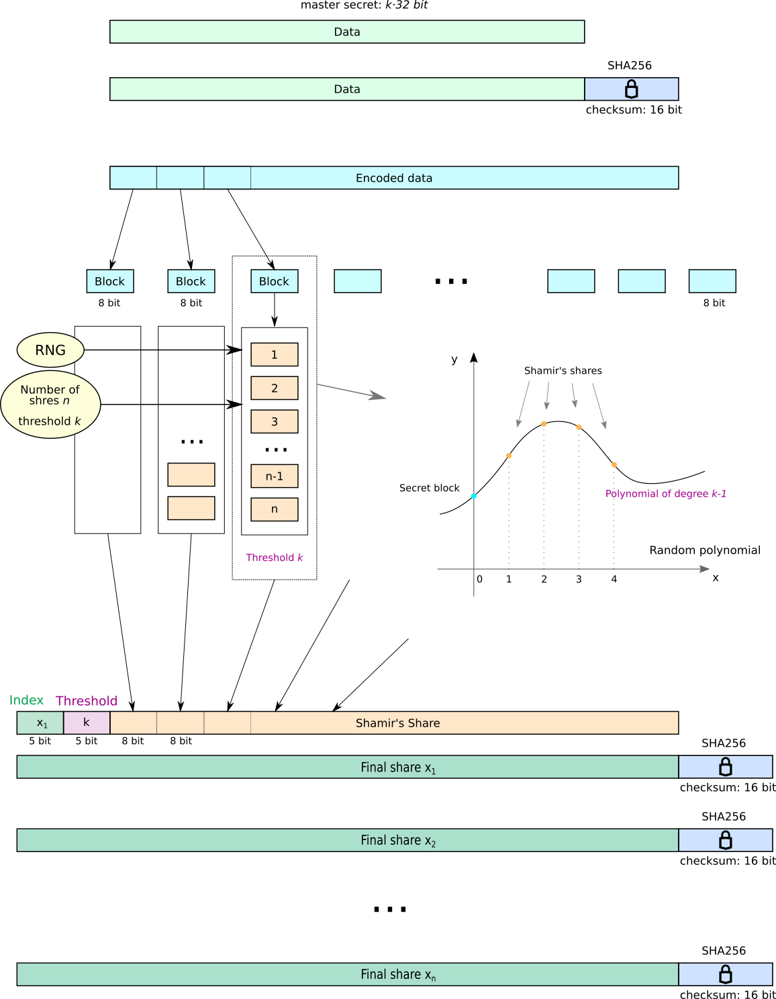
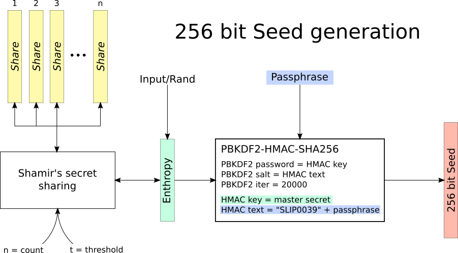

# Shamir's secret sharing scheme for HD-bitcoin wallets

[Shamir's secret sharing](https://en.wikipedia.org/wiki/Shamir%27s_Secret_Sharing) enables to split some secret between multiple parties in a secure way through the use of *shares*. In order to reconstruct original secret from shares, specific number of those shares is required (reconstruction threshold), while if not enough shares is available, no information about the secret is revealed.

There are many ways to implement this technique. This program implements design proposed in document [SLIP39](https://github.com/satoshilabs/slips/blob/master/slip-0039.md).
It operates on enthropy supplied in various forms, outputs shares encoded in mnemonic words and vice versa - reads mnemonic words and reconstructs original enthropy and optionally passes the result into `PBKDF2(PRF = HMAC-SHA256, Password = master_secret, Salt = "SLIP0039" + passphrase, iterations = 20000, dkLen = 256 bits)`, in order to produce seed.

**This is experimental implementation and may contain bugs - use it on your own responsibility.**

Current version of the program reads multiple of 32 bits of hex encoded enthropy from standard input and splits it into given number of Shamir's shares with a given reconstruction threshold. Each share is serialized string containing metadata (share index and reconstruction threshold), the secret share payload, and checksum for random errors detection. The string is encoded using wordlist, as specified in SLIP39.

In reconstruction mode program consumes shares, restores original secret (enthropy) and outputs either this secret or 256bit seed by passing the enthropy into `PBKDF2` (as stated above). Reconstruction threshold must be known and correct number of shares must be supplied, otherwise the reconstruction fails.

The simple schematics of how this was implemented is given in the following picture:<br>
<div align="center">
<a href="doc/long-message-shamir.png">
</a>
</div>

Following picture shows how 256 bit seed is generated from master secret:
<div align="center">
<a href="doc/Seed-derivation.png">
</a>
</div>

## Compilation
Program follows standard C++11 and can be compiled using command
```
cd src
$ make
```
in project directory.
It does not require any additional non-standard libraries, but requires access to device `/dev/urandom`.

## Basic usage
Data is read from stdin. Correct number of shares must be supplied in order to successfully recover master secret. Share *count* must be greater or equal to the reconstruction *threshold*, but not bigger than 32. Threshold must be at least 1.

```
$ ./shamir help
./shamir command  [ params ]
	commands:
		disthex <count> <threshold>		Reads hex-encoded enthropy
		distraw <count> <threshold>		Reads ASCII text.
		mergehex				Reads shares from stdin, one share per line. Correct number of shares must be supplied.
		mergeseed <passphrase>			Same as mergehex, but applies PBKDF2-SHA256 on the output (see SLIP39).
		mergeascii				Same as mergehex, but prints result as ascii string. This makes sense
							only to shares constructed from ascii text. The result may be cropped by null-char.
		help					Prints this help and exits.

$ openssl rand -hex 16 | ./shamir disthex 3 2
Distributes hex encoded enthropy into 3 shares with reconstruction threshold 2:
acid shock social spend volume shrimp valid diet weapon toast fancy robot antique element climb sense piece
anger jealous render gauge remind sheriff mistake equal buyer laugh climb patrol dumb genre idea spike favorite
axis brain panda wire decorate crucial purchase airport distance wrap staff laundry magnet manual faint rude segment

$ ./shamir mergehex << EOF
acid shock social spend volume shrimp valid diet weapon toast fancy robot antique element climb sense piece
axis brain panda wire decorate crucial purchase airport distance wrap staff laundry magnet manual faint rude segment
EOF
Merges shares into hex encoded enthropy:
a9b974e1d631f337476363e8059b38ae

$ ./shamir mergeseed 'very-secret-passphrase' << EOF
acid shock social spend volume shrimp valid diet weapon toast fancy robot antique element climb sense piece
axis brain panda wire decorate crucial purchase airport distance wrap staff laundry magnet manual faint rude segment
EOF
Merges into seed with passphrase: 'very-secret-passphrase':
65a198e19959e3a6965dd97155e9715b765d61bfb15a0bc76d791b4c00c56c0f
```
